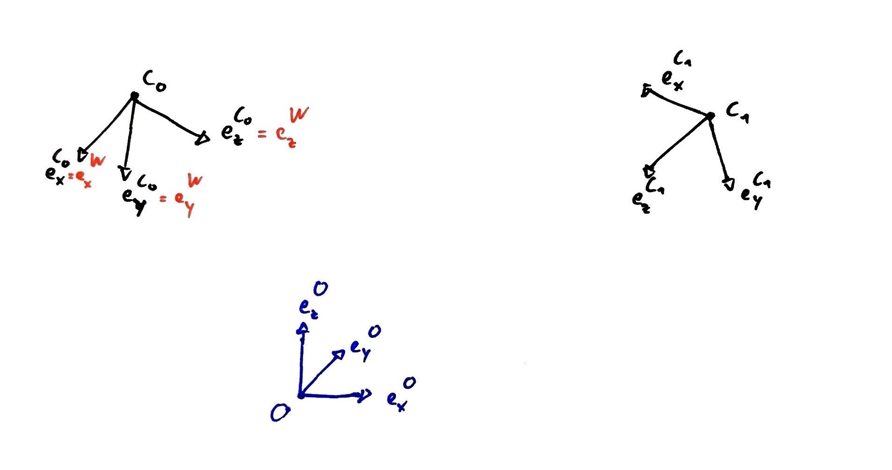

# Coordinate frames #

## Camera system ##
The camera system introduces three different coordinate frames:
* *C*: *C*amera coordinate frame attached to each camera. The *x*- and *y*-axis are aligned with the camera sensors' row and columns, respectively, and *z*-axis points towards the viewing direction of the camera.
* *W*: *W*orld coordinate frame. During the calibration procedure, one camera is chosen at random and its coordinate frame is selected as the world frame. The pose of all other cameras are given with respect to the world frame.
* *O*: The world frame is typically not very meaningful and hence introduce a third frame, the *O*rigin coordinate frame. The origin is typically set to the center of the table tennis table with its *x*-axis pointing along the length of the table and the *y*-axis along the width of the table. The origin is expressed with respect to the world frame and can hence be reset often without affecting the camera extrinsics or the need for re-calibrating the cameras.

The image below illustrates the different coordinate frames.

## Coordinate Transformation ##
Let's suppose a point **p** is expressed in the coordinate frame *C*, which is denoted by *C*\_**p**. The transformation to any arbitrary coordinate frame, e.g., *W*, is then given by

*W*\_**p** = **R**\_*WC* \* *C*\_**p** + *W*\_**t**\_*WC*,

where *W*\_**t**\_*WC* is the translation vector from the *W* to *C* frame, expressed in *W*. By using homogenous coordinates, i.e., **x**_h = [**x**, 1], the equation above can be written more compact as

[*W*\_**p**, 1] = **T**\_*WC* \*  [*C*\_**p**, 1],

where **T**\_*WC* is called a transformation matrix defined by

**T**\_*WC* = [[**R**\_*WC*, *W*\_**t**\_*WC*], [0, 0, 0, 1]],

and it transforms vectors from frame *C* to *W*. Transformation matrices can easily be concatenated, e.g., **T**\_*AC* = **T**\_*AB* \* **T**\_*BC*.
