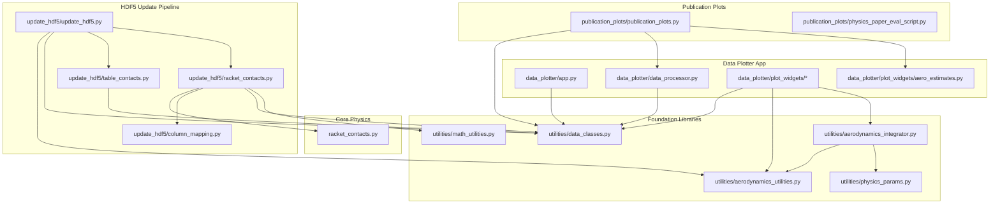
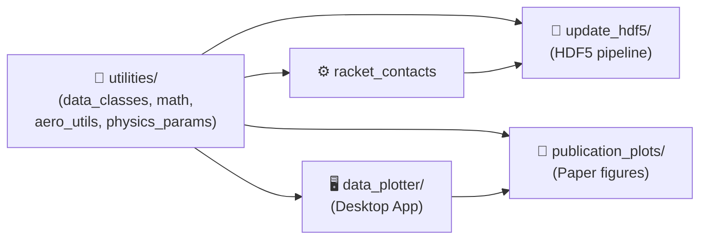

# ace_evaluation — Dependency Graph (Standalone)

## Module Architecture

```mermaid
graph TB
    subgraph "Foundation Libraries"
        DATA["utilities/data_classes.py"]
        MATH["utilities/math_utilities.py"]
        AERO_UTIL["utilities/aerodynamics_utilities.py"]
        AERO_INT["utilities/aerodynamics_integrator.py"]
        PHYS["utilities/physics_params.py"]
    end

    subgraph "Core Physics"
        RCM["racket_contacts.py"]
    end

    subgraph "HDF5 Update Pipeline"
        UH_MAP["update_hdf5/column_mapping.py"]
        UH_RC["update_hdf5/racket_contacts.py"]
        UH_TC["update_hdf5/table_contacts.py"]
        UH_MAIN["update_hdf5/update_hdf5.py"]
    end

    subgraph "Data Plotter App"
        DP_APP["data_plotter/app.py"]
        DP_PROC["data_plotter/data_processor.py"]
        DP_WIDGETS["data_plotter/plot_widgets/*"]
        DP_AERO["data_plotter/plot_widgets/aero_estimates.py"]
    end

    subgraph "Publication Plots"
        PUB_PLOTS["publication_plots/publication_plots.py"]
        PUB_EVAL["publication_plots/physics_paper_eval_script.py"]
    end

    %% Foundation dependencies
    AERO_INT --> AERO_UTIL
    AERO_INT --> PHYS

    %% Update HDF5 deps
    UH_MAIN --> AERO_UTIL
    UH_MAIN --> DATA
    UH_MAIN --> UH_TC
    UH_MAIN --> UH_RC
    UH_RC --> RCM
    UH_RC --> UH_MAP
    UH_RC --> DATA
    UH_RC --> MATH
    UH_TC --> DATA

    %% Data plotter deps
    DP_APP --> DATA
    DP_PROC --> DATA
    DP_WIDGETS --> DATA
    DP_WIDGETS --> AERO_UTIL
    DP_WIDGETS --> AERO_INT

    %% Publication plots deps
    PUB_PLOTS --> DATA
    PUB_PLOTS --> DP_PROC
    PUB_PLOTS --> DP_AERO
```

## Simplified View

```mermaid
graph LR
    FOUNDATION["🔧 utilities/\n(data_classes, math,\naero_utils, physics_params)"]
    PHYSICS["⚙️ racket_contacts"]
    UH["💾 update_hdf5/\n(HDF5 pipeline)"]
    DP["🖥️ data_plotter/\n(Desktop App)"]
    PUB["📄 publication_plots/\n(Paper figures)"]

    FOUNDATION --> PHYSICS
    FOUNDATION --> UH
    FOUNDATION --> DP
    PHYSICS --> UH
    FOUNDATION --> PUB
    DP --> PUB
```
